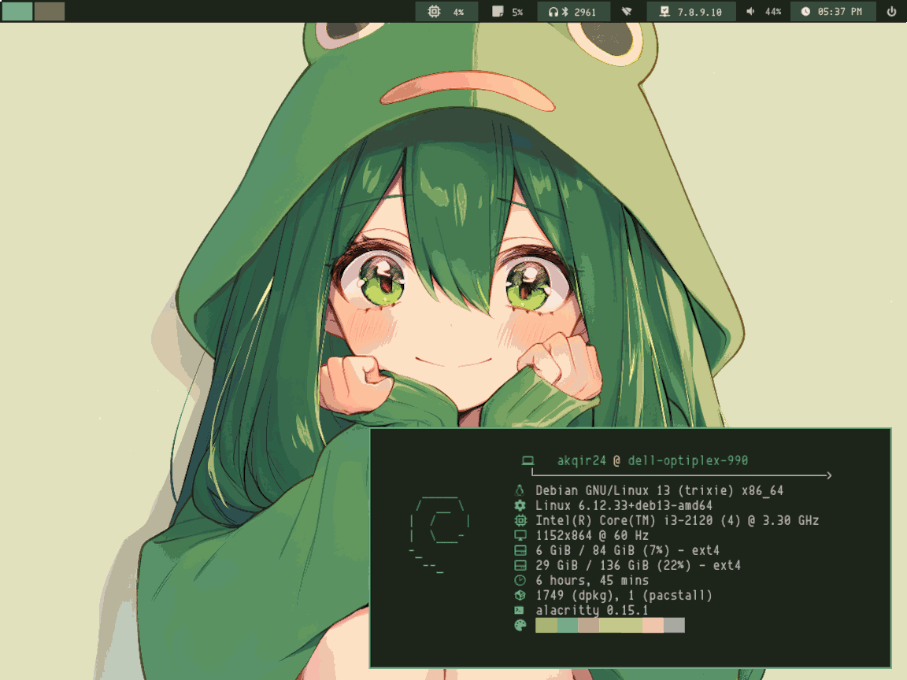

</img>

A bash script using the kdialog library to ease the configuration in [pywal16](https://github.com/eylles/pywal16).

> [!important] 
> The script may work in the using the normal `pywal` but it may fail to complete some steps of this script, so please use this fork of pywal called [pywal16](https://github.com/eylles/pywal16) in order to complete some steps in the script.

## SETUP
_**DEPENDENCIES**_
- `pywal16`
- `kdialog`
- `imagemagick`
- `yq` (for toml configuration)
- A wallpaper setter (optional):
  - `feh`
  - `hsetroot`
  - `xwallpaper`
  - `nitrogen`

- Debian ( or Other Debian based distro )
```bash
  sudo apt install kdialog pipx yq imagemagick xwallpaper
  pipx install pywal16
```

- Arch ( AUR )
```bash
  # You can use something else that works for you like paru
  yay -S kdialog pywal16 yq imagemagick xwallpaper
```
Other linux based distro might be different, so it may take to update this `README.md` file...
To load the changes set from the GUI...
<br>
## USAGE
Run the following commands in your terminal:
```bash
  git clone https://github.com/aKqir24/pywal16_scripts.git
  cd ~/pywal16_scripts
```
### walsetup (pywal+setup)
A simple bash script that makes use of kdialog to configure `pywal16`, so that you don't need to type a lot of commands. In addition, I added some features like wallpapers now be able to be solid or not, a setting for the wallpaper to be either fill, scale, and etc, then I added a script to generate gtk themes after pywal16 is done executing using [wpgtk's templates](https://github.com/deviantfero/wpgtk-templates) and for the icons I modified [Flat-Remix](https://github.com/daniruiz/Flat-Remix) icon pack for generating them...
```bash
  bash walsetup.sh --help # For more information 
  bash walsetup.sh --gui # To Configure it
  bash walsetup.sh # To Only Load the recent configuration
```

### waloml (pywal+toml)
- _Change i3status-rs theme_
```bash
  waloml.sh --i3status-rs=[CONFIG_FILE]
  bash wal.sh
```
- _Change Alacritty colors_
```bash
  bash waloml.sh --alacritty=[CONFIG_FILE]
```
- _Change Dunst Colors_
```bash
  bash waloml.sh --dunst
  pkill dunst ; dunst & 
```

## EXTRA
This script was especially made for i3wm using the debian 13 linux distro, so I highly recommend you check it out.

If you happen to use .xinit with i3wm and with or not my [dotfiles](https://aKqir24/.files), I already prepared the script for this here, just put it in you `.xinit file` or just look into my [dotfiles](https://aKqir24/.files):

```bash
bash $HOME/pywal16_scripts/walsetup.sh # To load the configuration!!
bash $HOME/pywal16_scripts/waloml.sh --alacritty --dunst \
	--i3status-rs=~/.files/.config/i3/status/config.toml
bash $HOME/pywal16_scripts/theming/rofi.sh
source $PYWAL16_OUT_DIR/colors-tty.sh

exec i3
```
> [!note]
> Not all are covered like changing the values of a wm config file, in this script yet, so feel free to commit some improvements to it...

## Future Plans
Things that I might add:
- [x] `walsetup` add verbose option...
- [ ] `walsetup` custom bg-color&bgsetup setup
- [x] `walsetup` wallpaper setter support in some de's
- [ ] `walsetup` Full icon pywal adptation support
- [x] `waloml` improve adding options
- [ ] `waloml` support for more terminals & appplications
- [x] `waloml` fix dunst color generation
